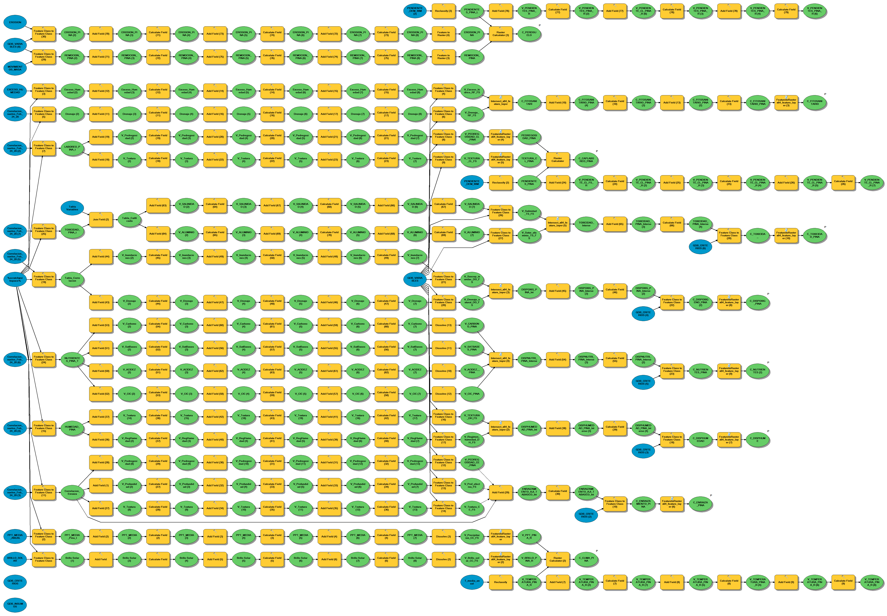
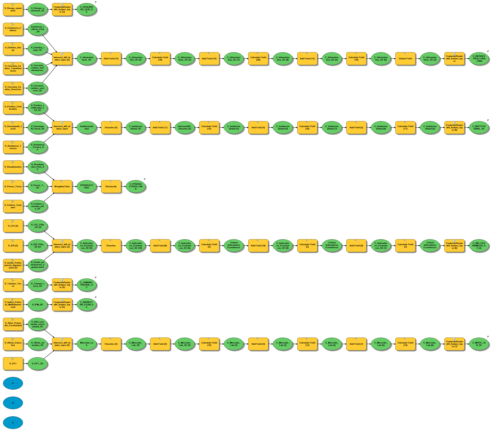

# Zonificación de aptitud para el cultivo de Piña
Modelos Análisis de ArcGIS 10.5 para la obtención de variables y criterios por componente.

# Modelos zonificación

Son herramientas de análisis espacial que permite identificar y delimitar las áreas con aptitud para el cultivo de piña comercial a 
escala 1:100.000, como base para el desarrollo técnico, ambiental y competitivo de esta actividad. La Zonificación, considera acercamientos 
metodológicos e información proveniente de diferentes entidades, incorporando los componentes físicos, sociecosistémicos y socioeconómicos, 
así como los lineamientos legales y normativos que inciden en la delimitación de áreas con aptitud para plantaciones de piña. 
Para mayor información dirigirse al repositorio de [zonificación](https://upraanalisis.github.io/zonificacion/). 

## Instalación

El proceso de instalación es el siguiente:

1. Descargar el `Modelo`:

    Existen dos opciones de descarga, se puede descargar todo el repositorio o solo el ultimo Release de los Modelos [Aquí](https://github.com/UpraAnalisis/zonificacion/releases/latest)

2. Descomprimir

3. Ir a ArcGIS y en la carpeta destino agregar ToolBox

4. Luego, ir a la carpeta donde se descargaron los modelos, copiar y pegar en el ToolBox creado en el paso 3

5. Abrir cada uno de los modelos con la opción Edit (click derecho sobre el modelo --> seleccionar Edit)

6. Validar cada uno de los modelos.

7. Ejecutar.

## Modelo físico

## Modelo socioecosistémico

## Modelo socioeconómico

Además de los modelos integrados por componente encontrará los modelos para cada una de las variables.

Palabras clave: zonificación, enfoque sistémico, evaluación de tierras, análisis multicriterio, competitividad.

